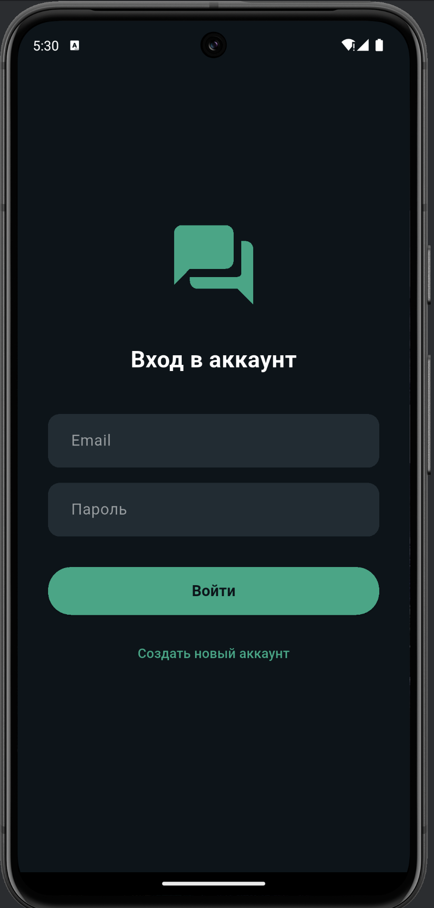
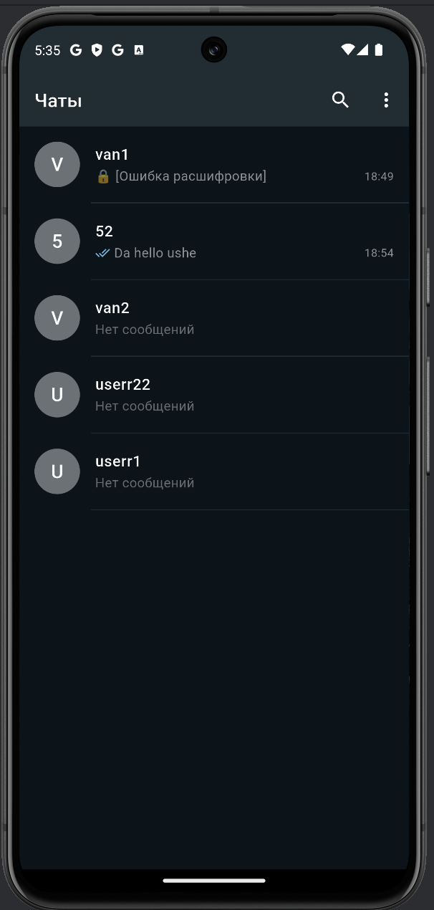
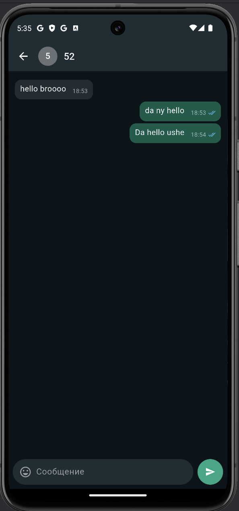

# NexChat 💬 🔒


**NexChat** — это современное, безопасное приложение для обмена сообщениями в реальном времени, созданное с использованием Flutter и Firebase. Проект включает сквозное (End-to-End) AES-шифрование, статусы прочтения сообщений и элегантный Dark-UI, вдохновленный WhatsApp.

## 📸 Скриншоты

| Авторизация | Список чатов |                                    Экран переписки                                     |
|:---:|:---:|:--------------------------------------------------------------------------------------:|
| Авторизация | Список чатов | Экран переписки |
|:---:|:---:|:---:|
|  |  |  |


## ✨ Ключевые возможности

* 🔒 **Сквозное шифрование (E2EE):** Все сообщения шифруются по стандарту **AES (CBC mode)** перед отправкой в базу данных.
* ⚡ **Реальное время:** Мгновенная доставка сообщений и обновление списка чатов с помощью Cloud Firestore `StreamBuilder`.
* 👀 **Статусы прочтения:** Индикаторы отправки и прочтения (✓ / ✓✓) меняют цвет, когда собеседник открывает чат.
* 🔍 **Умный поиск:** Быстрый поиск пользователей по Email для начала общения.
* 🎨 **Modern Dark UI:** Аккуратный темный интерфейс (цветовая палитра `#0B141A`, `#00A884`), оптимизированный для OLED-экранов.
* 🔐 **Аутентификация:** Безопасный вход и регистрация через Firebase Authentication.

## 🛠 Технологический стек

* **Frontend:** Flutter & Dart
* **Backend (BaaS):** Firebase (Authentication, Cloud Firestore)
* **Packages:**
    * `firebase_auth`, `cloud_firestore`, `firebase_core` — интеграция с Firebase.
    * `encrypt` — криптография (AES шифрование/дешифрование).
    * `intl` — форматирование времени и дат.

## 🏗 Архитектура и Структура проекта

Проект разделен на логические модули для удобства масштабирования и поддержки:

```text
lib/
├── screens/
│   ├── auth_screen.dart    # Экран входа/регистрации
│   ├── home_screen.dart    # Главный экран (список чатов и поиск)
│   └── chat_screen.dart    # UI окна переписки
├── services/
│   ├── chat_service.dart       # Логика работы с Firestore (отправка, чтение, стримы)
│   └── encryption_service.dart # Логика шифрования (AES)
├── main.dart               # Точка входа, настройка темы и роутинга